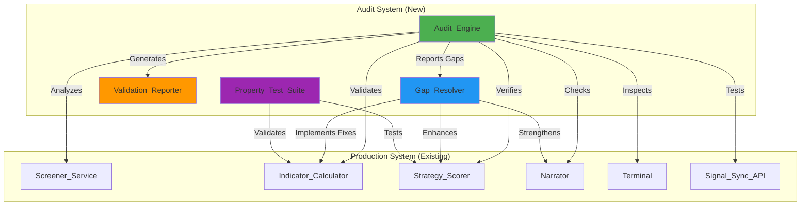
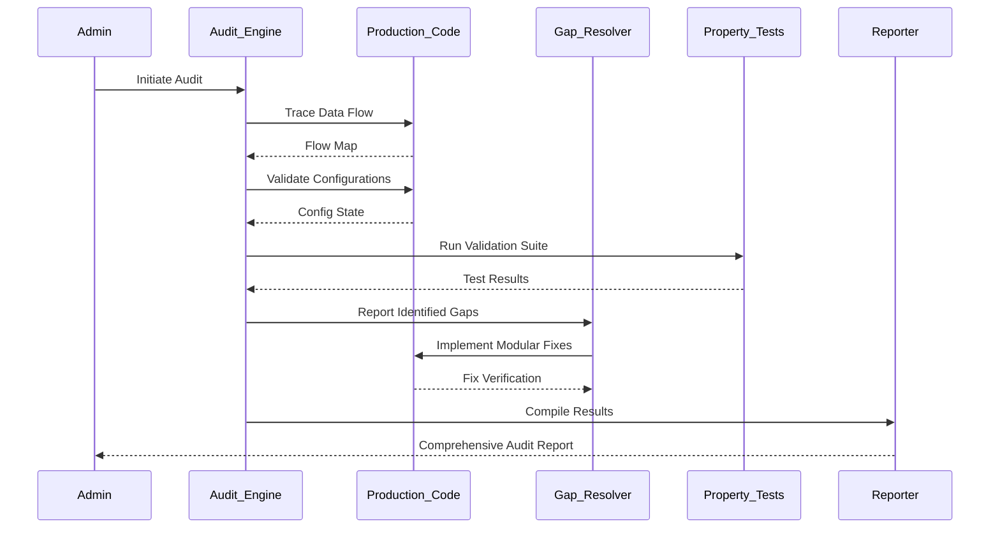

# Design Document: Signal Generation Workflow Audit

## Overview

This design specifies a comprehensive audit and enhancement system for the RSIQ Pro signal generation workflow. The system will verify end-to-end integrity from market data ingestion through indicator calculation, strategy scoring, narrator generation, and terminal display. The audit engine will identify gaps, validate configurations, and implement institutional-grade improvements while maintaining complete non-interference with production signal generation.

### Core Principles

1. **Non-Conflicting Architecture**: Audit system runs independently without modifying production signal logic
2. **Accuracy Verification**: Validates signal correctness through property-based testing and static analysis
3. **Modular Design**: Each audit component is independently testable and reversible
4. **Institutional Standards**: Applies professional trading system best practices throughout

### System Context

The RSIQ Pro trading application generates real-time trading signals through a multi-stage pipeline:

```
Market Data (Binance/Bybit) 
  → Screener_Service (kline fetch + indicator calculation)
  → Strategy_Scorer (composite scoring from multiple indicators)
  → Narrator (institutional-grade narrative generation)
  → Terminal (real-time UI display)
  → Signal_Sync_API (global win rate aggregation)
```

The audit system will verify each stage, validate configurations, detect gaps, and strengthen signal accuracy without disrupting existing functionality.

## Architecture

### High-Level Component Diagram



### Data Flow: Audit Pipeline



## Components and Interfaces

### 1. Audit_Engine

**Purpose**: Orchestrates the complete audit workflow, coordinates validation modules, and aggregates results.

**Interface**:

```typescript
interface AuditEngine {
  /**
   * Execute complete audit workflow
   * @param options - Audit configuration options
   * @returns Comprehensive audit results
   */
  executeAudit(options: AuditOptions): Promise<AuditResult>;
  
  /**
   * Verify end-to-end workflow integrity
   * @returns Workflow verification report
   */
  verifyWorkflow(): Promise<WorkflowVerificationReport>;
  
  /**
   * Validate default settings and global options
   * @returns Settings validation report
   */
  validateSettings(): Promise<SettingsValidationReport>;
  
  /**
   * Verify signal accuracy and consistency
   * @returns Signal accuracy report
   */
  verifySignalAccuracy(): Promise<SignalAccuracyReport>;
  
  /**
   * Validate narrator logic and output
   * @returns Narrator validation report
   */
  validateNarrator(): Promise<NarratorValidationReport>;
  
  /**
   * Detect gaps in implementation
   * @returns Gap detection report
   */
  detectGaps(): Promise<GapDetectionReport>;
}

interface AuditOptions {
  /** Run in read-only mode (no fixes applied) */
  readOnly: boolean;
  /** Specific modules to audit (empty = all) */
  modules: AuditModule[];
  /** Enable verbose logging */
  verbose: boolean;
  /** Generate property-based tests */
  generateTests: boolean;
}

type AuditModule = 
  | 'workflow'
  | 'settings'
  | 'accuracy'
  | 'narrator'
  | 'gaps'
  | 'performance'
  | 'realtime'
  | 'strategy'
  | 'calibration'
  | 'sync';

interface AuditResult {
  timestamp: number;
  duration: number;
  modules: ModuleResult[];
  gaps: Gap[];
  fixes: Fix[];
  overallStatus: 'pass' | 'warning' | 'fail';
  summary: string;
}
```

**Implementation Strategy**:

- Static analysis of production code using TypeScript AST parsing
- Runtime validation through test harness execution
- Configuration validation through schema comparison
- Non-invasive inspection (read-only by default)

### 2. Gap_Resolver

**Purpose**: Identifies implementation gaps and applies modular, reversible fixes.

**Interface**:

```typescript
interface GapResolver {
  /**
   * Analyze code for missing implementations
   * @param module - Module to analyze
   * @returns Detected gaps
   */
  analyzeGaps(module: string): Promise<Gap[]>;
  
  /**
   * Apply fix for identified gap
   * @param gap - Gap to fix
   * @param options - Fix options
   * @returns Fix result
   */
  applyFix(gap: Gap, options: FixOptions): Promise<FixResult>;
  
  /**
   * Verify fix correctness
   * @param fix - Applied fix
   * @returns Verification result
   */
  verifyFix(fix: Fix): Promise<VerificationResult>;
  
  /**
   * Rollback applied fix
   * @param fix - Fix to rollback
   * @returns Rollback result
   */
  rollbackFix(fix: Fix): Promise<RollbackResult>;
}

interface Gap {
  id: string;
  module: string;
  type: GapType;
  severity: 'critical' | 'high' | 'medium' | 'low';
  description: string;
  location: CodeLocation;
  suggestedFix: string;
}

type GapType =
  | 'missing_calculation'
  | 'inconsistent_weighting'
  | 'missing_error_handling'
  | 'incomplete_realtime_logic'
  | 'missing_test_coverage'
  | 'configuration_mismatch';

interface Fix {
  id: string;
  gapId: string;
  type: 'code' | 'config' | 'test';
  changes: FileChange[];
  rationale: string;
  impactAnalysis: string;
  reversible: boolean;
}
```

**Implementation Strategy**:

- Pattern matching for common gap types
- Template-based fix generation
- Git-based rollback mechanism
- Comprehensive impact analysis before applying fixes

### 3. Validation_Reporter

**Purpose**: Generates comprehensive audit reports with actionable insights.

**Interface**:

```typescript
interface ValidationReporter {
  /**
   * Generate comprehensive audit report
   * @param results - Audit results
   * @returns Formatted report
   */
  generateReport(results: AuditResult): Promise<string>;
  
  /**
   * Generate workflow diagram
   * @param workflow - Workflow verification data
   * @returns Mermaid diagram
   */
  generateWorkflowDiagram(workflow: WorkflowVerificationReport): string;
  
  /**
   * Generate gap analysis section
   * @param gaps - Detected gaps
   * @returns Markdown section
   */
  generateGapAnalysis(gaps: Gap[]): string;
  
  /**
   * Generate recommendations
   * @param results - Audit results
   * @returns Recommendations list
   */
  generateRecommendations(results: AuditResult): string[];
}
```

### 4. Property_Test_Suite

**Purpose**: Validates signal generation correctness through property-based testing.

**Interface**:

```typescript
interface PropertyTestSuite {
  /**
   * Run all property-based tests
   * @returns Test results
   */
  runAll(): Promise<PropertyTestResult[]>;
  
  /**
   * Test indicator calculation properties
   * @returns Test results
   */
  testIndicatorProperties(): Promise<PropertyTestResult[]>;
  
  /**
   * Test strategy scoring properties
   * @returns Test results
   */
  testStrategyProperties(): Promise<PropertyTestResult[]>;
  
  /**
   * Test narrator generation properties
   * @returns Test results
   */
  testNarratorProperties(): Promise<PropertyTestResult[]>;
}

interface PropertyTestResult {
  propertyName: string;
  passed: boolean;
  iterations: number;
  counterexample?: unknown;
  shrunkExample?: unknown;
  error?: string;
}
```

**Testing Framework**: fast-check (TypeScript property-based testing library)

## Data Models

### Workflow Verification Report

```typescript
interface WorkflowVerificationReport {
  dataFlow: {
    stage: string;
    verified: boolean;
    issues: string[];
  }[];
  components: {
    name: string;
    status: 'verified' | 'warning' | 'failed';
    details: string;
  }[];
  integrationPoints: {
    from: string;
    to: string;
    verified: boolean;
    dataIntegrity: boolean;
  }[];
}
```

### Settings Validation Report

```typescript
interface SettingsValidationReport {
  rsiDefaults: {
    configured: typeof RSI_DEFAULTS;
    usage: {
      location: string;
      value: unknown;
      matches: boolean;
    }[];
  };
  indicatorDefaults: {
    configured: typeof INDICATOR_DEFAULTS;
    usage: {
      location: string;
      value: unknown;
      matches: boolean;
    }[];
  };
  assetSpecificZones: {
    market: string;
    configured: typeof RSI_ZONES[keyof typeof RSI_ZONES];
    applied: boolean;
    locations: string[];
  }[];
  inconsistencies: {
    setting: string;
    expected: unknown;
    actual: unknown;
    location: string;
  }[];
}
```

### Signal Accuracy Report

```typescript
interface SignalAccuracyReport {
  indicatorTests: {
    indicator: string;
    rangeTests: {
      name: string;
      passed: boolean;
      details: string;
    }[];
    edgeCaseTests: {
      case: string;
      passed: boolean;
      details: string;
    }[];
  }[];
  strategyScoreTests: {
    clampingVerified: boolean;
    consistencyVerified: boolean;
    examples: {
      input: unknown;
      output: number;
      signal: string;
      valid: boolean;
    }[];
  };
  realtimeConsistency: {
    approximationAccuracy: number;
    maxDeviation: number;
    verified: boolean;
  };
}
```

### Narrator Validation Report

```typescript
interface NarratorValidationReport {
  convictionAlgorithm: {
    verified: boolean;
    formula: string;
    testCases: {
      input: unknown;
      expectedConviction: number;
      actualConviction: number;
      passed: boolean;
    }[];
  };
  pillarConfluence: {
    verified: boolean;
    bonusCalculation: string;
    examples: {
      pillars: string[];
      bonus: number;
      correct: boolean;
    }[];
  };
  assetSpecificContext: {
    market: string;
    contextGenerated: boolean;
    appropriate: boolean;
    examples: string[];
  }[];
  formattingValidation: {
    numericPrecision: boolean;
    emojiPresence: boolean;
    shareLineFormat: boolean;
  };
}
```

## Correctness Properties

*A property is a characteristic or behavior that should hold true across all valid executions of a system—essentially, a formal statement about what the system should do. Properties serve as the bridge between human-readable specifications and machine-verifiable correctness guarantees.*

### Property 1: RSI Range Invariant

*For any* valid close price array with sufficient data (≥ RSI period + 1), the calculated RSI value SHALL be between 0 and 100 inclusive for all timeframes (1m, 5m, 15m, 1h).

**Validates: Requirements 3.1**

**Test Strategy**: Generate random price arrays of varying lengths and volatility profiles. Verify RSI output is always in [0, 100] range.

### Property 2: MACD Histogram Normalization

*For any* valid close price array, when ATR is available and positive, the MACD histogram SHALL be normalized using ATR; when ATR is unavailable, it SHALL fall back to price-relative scaling without producing NaN or Infinity.

**Validates: Requirements 3.2**

**Test Strategy**: Generate random price arrays with and without ATR values. Verify normalization produces finite numeric values in all cases.

### Property 3: Bollinger Band Position Clamping

*For any* valid close price array, the Bollinger Band position SHALL be clamped to [0, 1] range even when the current price is outside the bands.

**Validates: Requirements 3.3**

**Test Strategy**: Generate price arrays with extreme outliers. Verify BB position never exceeds [0, 1] bounds.

### Property 4: Strategy Score Clamping

*For any* combination of indicator values, the strategy score SHALL always be between -100 and +100 inclusive.

**Validates: Requirements 3.5**

**Test Strategy**: Generate random indicator combinations including extreme values. Verify score is always clamped to [-100, 100].

### Property 5: Signal Classification Consistency

*For any* strategy score, the derived signal classification (strong-buy, buy, neutral, sell, strong-sell) SHALL be consistent with the score thresholds and SHALL produce the same classification for the same score across all invocations.

**Validates: Requirements 3.6**

**Test Strategy**: Generate random scores across the full range. Verify classification is deterministic and threshold-consistent.

### Property 6: Real-Time Approximation Consistency

*For any* RSI state and new price tick, the approximated RSI value SHALL differ from a full recalculation by no more than 0.5 RSI points under normal market conditions (price change < 5%).

**Validates: Requirements 3.7**

**Test Strategy**: Generate price series, compute full RSI, then simulate real-time updates. Verify approximation accuracy within tolerance.

### Property 7: Narrator Conviction Calculation

*For any* valid ScreenerEntry with non-neutral strategy signal, the narrator conviction score SHALL be calculated using the formula: (|netBias| / maxPossible) × 100 × scaleFactor + confluenceBonus, and SHALL be between 0 and 100 inclusive.

**Validates: Requirements 4.2**

**Test Strategy**: Generate random ScreenerEntry objects with varying indicator combinations. Verify conviction formula and range.

### Property 8: Narrator Pillar Confluence Bonus

*For any* signal with N active analytical pillars (momentum, trend, structure, liquidity, volatility), the conviction score SHALL include a confluence bonus of 12 × (N - 1) points.

**Validates: Requirements 4.3**

**Test Strategy**: Generate signals with 1-5 active pillars. Verify bonus calculation matches formula.

### Property 9: Asset-Specific RSI Zone Application

*For any* asset with market classification (Crypto, Forex, Metal, Index, Stocks), the RSI overbought/oversold zones SHALL match the configured zones for that asset class in all signal derivation and scoring functions.

**Validates: Requirements 2.3, 9.1**

**Test Strategy**: Generate signals for each asset class. Verify correct zone thresholds are applied.

### Property 10: Default Settings Consistency

*For any* indicator calculation or strategy scoring invocation, when no custom configuration is provided, the values from RSI_DEFAULTS and INDICATOR_DEFAULTS SHALL be used consistently across all modules.

**Validates: Requirements 2.1, 2.2**

**Test Strategy**: Trace default value usage across codebase. Verify all references use centralized defaults.

### Property 11: Indicator Edge Case Handling

*For any* indicator calculation function, when provided with insufficient data, null values, or edge cases (zero division, empty arrays), the function SHALL return null or a safe fallback value without throwing exceptions or producing NaN/Infinity.

**Validates: Requirements 3.4, 8.1, 8.2, 8.3, 8.4**

**Test Strategy**: Generate edge case inputs (empty arrays, single values, null values, zero denominators). Verify graceful handling.

### Property 12: Strategy Strengthening Rules

*For any* strategy score calculation with fewer than 4 active factors, the score SHALL be dampened; when ADX < 18, a 0.7× multiplier SHALL be applied; when ADX > 30 and aligns with bias, a 1.2× multiplier SHALL be applied.

**Validates: Requirements 7.1, 7.3, 7.4**

**Test Strategy**: Generate strategy inputs with varying factor counts and ADX values. Verify multipliers are correctly applied.

### Property 13: Signal Sync Increment Atomicity

*For any* valid signal sync request, the Redis HINCRBY operations SHALL atomically increment the global statistics (total, win5m, win15m, win1h, evaluated5m, evaluated15m, evaluated1h) without data loss or race conditions.

**Validates: Requirements 10.1**

**Test Strategy**: Simulate concurrent sync requests. Verify final counts match expected sum (requires integration test with Redis mock).

### Property 14: Win Rate Calculation Correctness

*For any* non-zero evaluated count, the win rate percentage SHALL be calculated as (winCount / evaluatedCount) × 100 and SHALL be between 0 and 100 inclusive.

**Validates: Requirements 10.4**

**Test Strategy**: Generate random win/evaluated count pairs. Verify percentage calculation and range.

### Property 15: Narrator Numeric Formatting

*For any* numeric value in narrator output, RSI values SHALL be formatted to 1 decimal place, prices SHALL use dynamic precision based on magnitude, and percentages SHALL use 2 decimal places.

**Validates: Requirements 4.6**

**Test Strategy**: Generate narrator output for various numeric ranges. Verify formatting precision matches specification.

## Error Handling

### Error Handling Strategy

The audit system implements a layered error handling approach:

1. **Validation Layer**: Catch and report validation errors without halting audit
2. **Execution Layer**: Isolate module failures to prevent cascade
3. **Reporting Layer**: Aggregate all errors for comprehensive reporting

### Error Categories

```typescript
enum AuditErrorType {
  VALIDATION_ERROR = 'validation_error',
  EXECUTION_ERROR = 'execution_error',
  CONFIGURATION_ERROR = 'configuration_error',
  TEST_FAILURE = 'test_failure',
  GAP_DETECTION_ERROR = 'gap_detection_error',
  FIX_APPLICATION_ERROR = 'fix_application_error',
}

interface AuditError {
  type: AuditErrorType;
  module: string;
  message: string;
  stack?: string;
  recoverable: boolean;
  context: Record<string, unknown>;
}
```

### Error Recovery

- **Validation Errors**: Log and continue with remaining validations
- **Execution Errors**: Skip failed module, mark as failed in report
- **Configuration Errors**: Use safe defaults, flag for manual review
- **Test Failures**: Record failure details, continue with remaining tests
- **Fix Application Errors**: Rollback partial changes, preserve original state

### Production System Protection

The audit system SHALL NOT:
- Modify production code without explicit approval
- Interfere with real-time signal generation
- Introduce breaking changes to existing APIs
- Alter database state during read-only audits

All fixes SHALL be:
- Applied in isolated branches
- Tested independently before integration
- Reversible through Git rollback
- Documented with impact analysis

## Testing Strategy

### Dual Testing Approach

The audit system employs both unit tests and property-based tests for comprehensive coverage:

**Unit Tests**: Verify specific audit behaviors, module interactions, and edge cases
**Property Tests**: Validate universal properties across all signal generation scenarios

### Property-Based Testing Configuration

**Framework**: fast-check (https://github.com/dubzzz/fast-check)

**Configuration**:
- Minimum 100 iterations per property test
- Shrinking enabled for counterexample minimization
- Seed-based reproducibility for failed tests
- Timeout: 30 seconds per property

**Property Test Tags**: Each property test SHALL include a comment tag referencing the design property:

```typescript
/**
 * Feature: signal-generation-workflow-audit, Property 1: RSI Range Invariant
 * For any valid close price array, RSI SHALL be between 0 and 100
 */
test('RSI range invariant', () => {
  fc.assert(
    fc.property(
      fc.array(fc.float({ min: 0.01, max: 100000 }), { minLength: 15, maxLength: 1000 }),
      (closes) => {
        const rsi = calculateRsi(closes, 14);
        return rsi === null || (rsi >= 0 && rsi <= 100);
      }
    ),
    { numRuns: 100 }
  );
});
```

### Unit Test Coverage

**Audit_Engine**:
- Workflow verification logic
- Settings validation logic
- Gap detection algorithms
- Report generation

**Gap_Resolver**:
- Gap pattern matching
- Fix generation
- Rollback mechanisms
- Impact analysis

**Validation_Reporter**:
- Report formatting
- Diagram generation
- Recommendation logic

**Property_Test_Suite**:
- Test harness execution
- Result aggregation
- Counterexample handling

### Integration Tests

**Workflow Integration**:
- End-to-end audit execution
- Multi-module coordination
- Report generation pipeline

**Production System Integration**:
- Non-invasive inspection
- Configuration validation
- Real-time flow verification

### Test Data Generation

**Generators**:
- Random price arrays (various lengths, volatility profiles)
- Random indicator combinations
- Random ScreenerEntry objects
- Edge case scenarios (empty arrays, null values, extreme values)

**Strategies**:
- Fuzzing for edge case discovery
- Mutation testing for robustness
- Regression test suite from historical bugs

## Implementation Approach

### Phase 1: Audit Infrastructure (Week 1)

**Deliverables**:
- Audit_Engine core implementation
- Validation_Reporter basic functionality
- CLI interface for audit execution
- Initial test harness

**Risk Mitigation**:
- Read-only mode enforced by default
- Comprehensive logging
- Dry-run capability

### Phase 2: Workflow Verification (Week 2)

**Deliverables**:
- Data flow tracing implementation
- Component verification logic
- Integration point validation
- Workflow diagram generation

**Risk Mitigation**:
- Static analysis only (no runtime modification)
- Isolated test environment
- Rollback procedures documented

### Phase 3: Settings & Configuration Validation (Week 2)

**Deliverables**:
- Default settings validation
- Asset-specific zone verification
- Configuration consistency checks
- Settings validation report

**Risk Mitigation**:
- Schema-based validation
- No configuration modification
- Discrepancy flagging only

### Phase 4: Signal Accuracy Verification (Week 3)

**Deliverables**:
- Property-based test suite (Properties 1-6)
- Indicator edge case tests
- Strategy score validation
- Real-time consistency tests

**Risk Mitigation**:
- Isolated test execution
- No production data modification
- Comprehensive test coverage

### Phase 5: Narrator Validation (Week 3)

**Deliverables**:
- Property-based tests (Properties 7-8, 15)
- Conviction algorithm verification
- Asset-specific context validation
- Formatting validation

**Risk Mitigation**:
- Sample-based validation
- No narrator logic modification
- Output comparison only

### Phase 6: Gap Detection & Resolution (Week 4)

**Deliverables**:
- Gap_Resolver implementation
- Pattern-based gap detection
- Fix generation templates
- Impact analysis tools

**Risk Mitigation**:
- Manual approval required for fixes
- Git-based rollback
- Comprehensive impact analysis
- Modular fix application

### Phase 7: Performance & Scalability Validation (Week 4)

**Deliverables**:
- Performance benchmarking
- Scalability tests
- Optimization recommendations
- Performance validation report

**Risk Mitigation**:
- Non-production environment testing
- Load testing in isolation
- No performance modifications without approval

### Phase 8: Documentation & Reporting (Week 5)

**Deliverables**:
- Comprehensive audit report
- Workflow diagrams
- Gap analysis documentation
- Recommendations for future enhancements

**Risk Mitigation**:
- Peer review of findings
- Stakeholder approval before fixes
- Clear documentation of all changes

### Rollback Strategy

All changes SHALL be reversible through:

1. **Git-based rollback**: All fixes committed to feature branches
2. **Configuration snapshots**: Pre-audit configuration saved
3. **Database backups**: State preserved before any modifications
4. **Feature flags**: New functionality behind toggles
5. **Incremental deployment**: Gradual rollout with monitoring

### Monitoring & Validation

**Audit Execution Monitoring**:
- Execution time tracking
- Module success/failure rates
- Gap detection statistics
- Fix application success rates

**Production System Monitoring** (post-fix):
- Signal generation latency
- Indicator calculation accuracy
- Strategy score distribution
- Narrator generation success rate
- Terminal rendering performance

### Success Criteria

The audit is considered successful when:

1. All 12 requirements have corresponding validation modules
2. All 15 correctness properties pass with 100 iterations
3. Zero critical gaps remain unresolved
4. All high-severity gaps have documented fixes
5. Comprehensive audit report generated
6. No production system degradation observed
7. All fixes are reversible and documented

## Integration Points

### Screener_Service Integration

**Inspection Points**:
- Kline fetch logic (Binance, Bybit, Yahoo)
- Indicator calculation invocations
- Caching mechanisms
- Error handling paths

**Validation**:
- Data flow correctness
- Configuration usage
- Edge case handling
- Performance characteristics

**Non-Interference**:
- Read-only code analysis
- No runtime modification
- Isolated test execution

### Indicator_Calculator Integration

**Inspection Points**:
- RSI calculation (all timeframes)
- MACD calculation and normalization
- Bollinger Bands calculation
- All other indicator functions

**Validation**:
- Range invariants
- Edge case handling
- Null value handling
- Numeric stability

**Non-Interference**:
- Property-based testing in isolation
- No production function modification
- Test harness execution only

### Strategy_Scorer Integration

**Inspection Points**:
- computeStrategyScore function
- Factor weighting logic
- ADX multipliers
- Counter-trend penalties

**Validation**:
- Score clamping
- Signal classification consistency
- Strengthening rules application
- Asset-specific calibration

**Non-Interference**:
- Unit test validation
- Property test validation
- No scoring logic modification

### Narrator Integration

**Inspection Points**:
- generateSignalNarration function
- Conviction calculation
- Pillar confluence logic
- Asset-specific context generation

**Validation**:
- Conviction formula correctness
- Pillar bonus calculation
- Formatting precision
- Context appropriateness

**Non-Interference**:
- Sample-based validation
- Output comparison only
- No narrative logic modification

### Terminal Integration

**Inspection Points**:
- ScreenerDashboard component
- Signal display logic
- Real-time update handling
- Viewport optimization

**Validation**:
- Data flow correctness
- UI state consistency
- Update propagation
- Performance characteristics

**Non-Interference**:
- Component inspection only
- No UI modification
- Isolated rendering tests

### Signal_Sync_API Integration

**Inspection Points**:
- Redis HINCRBY operations
- Rate limiting logic
- Win rate calculations
- Error handling

**Validation**:
- Atomic increment correctness
- Rate limit enforcement
- Calculation accuracy
- Fallback behavior

**Non-Interference**:
- Mock-based testing
- No Redis state modification
- Isolated API testing

## Future Enhancements

### Continuous Audit Mode

Implement continuous audit execution on a schedule:
- Daily workflow verification
- Weekly comprehensive audit
- Real-time gap detection
- Automated fix suggestions

### Machine Learning Integration

Enhance gap detection with ML:
- Pattern recognition for common gaps
- Anomaly detection in signal generation
- Predictive fix recommendation
- Automated test case generation

### Performance Optimization

Identify and implement performance improvements:
- Indicator calculation optimization
- Caching strategy enhancement
- Real-time update efficiency
- Database query optimization

### Extended Asset Class Support

Expand calibration for additional asset classes:
- Commodities (beyond metals)
- Bonds and fixed income
- Options and derivatives
- Alternative assets (NFTs, tokenized assets)

### Advanced Narrator Features

Enhance narrative generation:
- Multi-language support
- Customizable narrative styles
- Sentiment analysis integration
- Historical context inclusion

## Appendix: Technology Stack

### Core Technologies

- **Language**: TypeScript 5.x
- **Runtime**: Node.js 20.x
- **Testing Framework**: Vitest
- **Property Testing**: fast-check
- **Static Analysis**: TypeScript Compiler API
- **Reporting**: Markdown generation
- **Diagramming**: Mermaid

### Development Tools

- **Version Control**: Git
- **CI/CD**: GitHub Actions (assumed)
- **Code Quality**: ESLint, Prettier
- **Documentation**: Markdown, JSDoc

### Production Dependencies

- **Redis**: Signal sync storage
- **Prisma**: Database ORM
- **Next.js**: Application framework
- **React**: UI framework

## Appendix: Glossary

- **Audit_Engine**: Orchestration component for audit workflow
- **Gap_Resolver**: Component that identifies and fixes implementation gaps
- **Property-Based Testing**: Testing approach that validates universal properties across many generated inputs
- **Signal Generation Pipeline**: Complete workflow from market data to terminal display
- **Screener_Service**: Backend service for market data and indicator calculation
- **Strategy_Scorer**: Component that produces composite buy/sell scores
- **Narrator**: Signal Narration Engine that generates human-readable explanations
- **Terminal**: Primary UI component displaying real-time signals
- **Signal_Sync_API**: Redis-backed API for global win rate aggregation
- **Indicator_Calculator**: Collection of technical indicator calculation functions
- **RSI**: Relative Strength Index (momentum oscillator)
- **MACD**: Moving Average Convergence Divergence (trend indicator)
- **Bollinger Bands**: Volatility indicator using standard deviations
- **ATR**: Average True Range (volatility measure)
- **ADX**: Average Directional Index (trend strength)
- **Confluence**: Agreement across multiple indicators/timeframes
- **Pillar**: Analytical category (momentum, trend, structure, liquidity, volatility)
